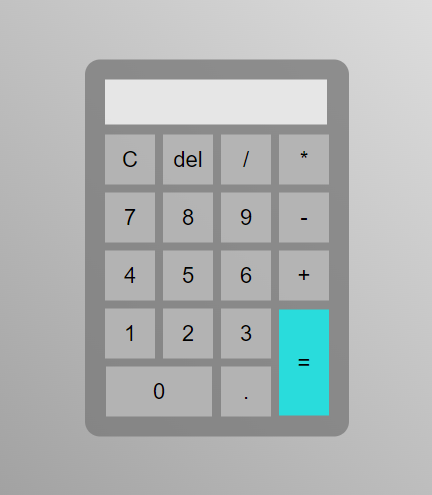

# Exercício em JavaScript - Calculadora

### Proposta

#### Fazer uma calculadora usando:
- **HTML** simples;
- Estilo em **CSS**, para que ela fique com aparência de uma calculadora de sistema operacional;
- Funções em **JavaScript** separadas para os números e os cálculos. 

#### Minimamente a calculadora deve realizar:
- Soma; 
- Subtração.

#### Adicionalmente, ela pode ter:
- Funções de **divisão** e **multiplicação**;
- Capacidade de realizar **vários cálculos** na mesma digitação;
- **Responsividade** para poder ser vizualizada no celular.

### Entrega

### **HTML**

A estrutura foi feita com uma ***'div'*** para o fundo e outra ***'div'*** para a calculadora, um ***'p'*** para o display e uma ***'table'*** para as teclas da calculadora. O parágrafo ***'p'*** possui um **id**, é por meio dele que se identifica em qual parte devem aparecer os valores digitados na calculadora.

Dez botões numéricos:
- de 0 a 9;

Cinco botões de operação:
- Soma (+);
- Subtração (-);
- Divisão (/);
- Multiplicação (*);
- Igual (=).

Três botões auxiliares: 
- Clear (C);
- Delete (del);
- Ponto (.).

### **CSS**

Foi usada a fonte ***'Roboto'*** importada do [Google fonts](https://fonts.google.com/). 

Inicialmente aplicada uma formatação genérica para todo o documento (***margin*** e ***padding***), em seguida aplicado estilo na classe ***'.fundo'***, na classe ***'.calculadora'*** e na classe ***'.botao'***, além de ser aplicado ***'hover'*** aos botões para que esses sinalizem com mudança de cor quando o mouse passar por cima deles.

Por fim foi aplicado estilo ao **id** ***'#resultado'***.

Todas as formatações contêm intens básicos como cor de fundo (***background-color***), tamanho (***width e height***), cor da fonte (***color***) e tamanho (***font-size***), alinhamento do texto (***text-align***), além de estilo da borda (***border*** e ***border-radius***), posicionamento (***position***), transição dos botões (***trasform***) e estilo do cursor (***cursor***).

### **JavaScript**

O script possui as funções:
- ***insert***: para inserir números e operadores no display da calculadora. Os valores inseridos (numeros e operadores) são alocados em uma variável que recebe o valor da própria variável concatenada com o parâmentro 'num'. Isso possibilita que uma sequência de digitos apareça no display e não apenas um valor por vez;
```
function insert(num) {
  var numero = document.getElementById('resultado').innerHTML;
  document.getElementById('resultado').innerHTML = numero + num;
}
```

- ***clean***: para limpar o display. Quando acionada essa função pega o campo do display (p) por seu id (resultado) e coloca nele uma string vazia ("").
```
function clean() {
  document.getElementById('resultado').innerHTML = "";
}
```

- ***back***: para deletar dígitos da direita para a esquerda, apagando um dígito por vez. Para isso utiliza o id (resultado) para acessar o elemento display (p), o aloca em uma variável local (resultdo) e quando acinada a função coloca na variável a própria variável com o método [***'substring'***](https://developer.mozilla.org/pt-BR/docs/Web/JavaScript/Reference/Global_Objects/String/substring). Esse método usa como parâmetro o índice onde deve começar a nova string, no caso o índice 0, e onde deve terminar, no caso, o tamanho da string original -1. Assim o último dígito é sempre retirado quando a função é acionada;
```
function back() {
  var resultado = document.getElementById('resultado').innerHTML;
  document.getElementById('resultado').innerHTML = resultado.substring(0, resultado.length - 1);
}
```

- ***calculate***: para realizar os cálculos. É acionada na tecla 'igual' (=). Para realizar o cálculo é usado um método nativo do JavaScript chamado ***'eval'***, ele realiza o cálculo de um código JavaScript representado como uma string. Alguns cuidados devem ser tomados ao usar esse método, mais informações [aqui](https://developer.mozilla.org/pt-BR/docs/Web/JavaScript/Reference/Global_Objects/eval).

Para um melhor uso da função ***calculate***, ela contem uma estrutura de decisão na qual o retorno pode ser o cálculo caso o display contenha valores, ou o retorno pode ser uma string vazia ("") caso não haja nada digitado no display.
```
function calculate() {
  let resultado = document.getElementById('resultado').innerHTML;
  if (resultado) {
    document.getElementById('resultado').innerHTML = eval(resultado);
  } else {
    document.getElementById('resultado').innerHTML = "";
  }
}
```

O resultado final é esse 

: