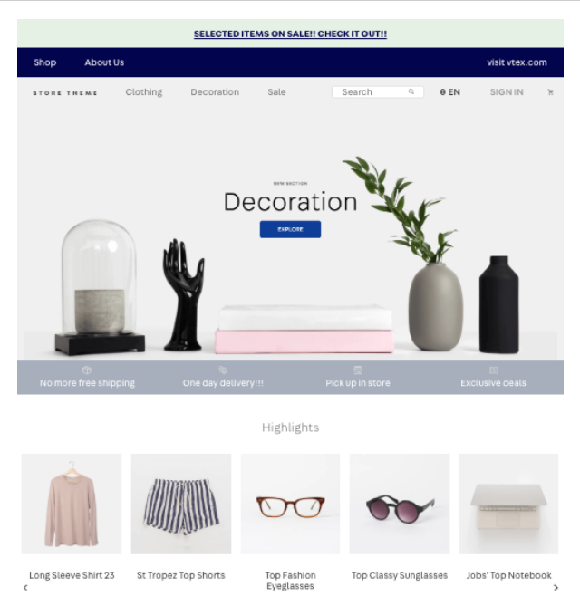
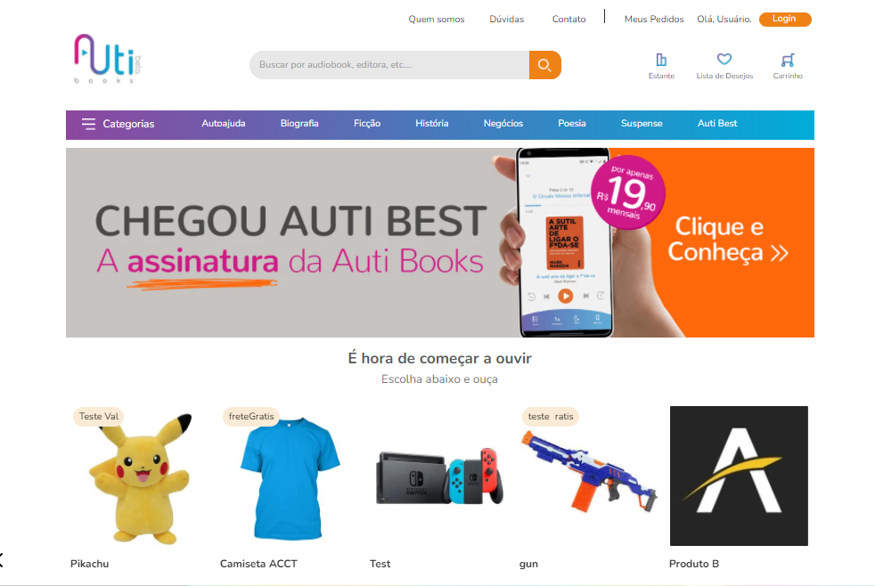

# **Módulo 4: VTEX IO Store Framework Training**

O que é esperado deste tópico:
- [x] Replicar uma das páginas disponibilizadas em VTEX IO, usando apenas o store-framework.
  -  Aplicar os conceitos mobile first e responsividade.
  - Não criar nenhum componente com React.
- [x] Criar uma branch a partir da master do repositório store-theme-training, usando [Store Theme](https://gitlab.com/acct.global/acct.vtexio-projects/store-theme-training) como a base do projeto 
- [] Enviar o Link da WS e do MR

Páginas que podem ser replicadas:
- [BEIRA](https://en.beira.shop/)
- [Merci](https://www.merciwithlove.com.br/)
- [Americanas](https://www.americanas.com.br/hotsite/americanas-social?chave=dk_hm_tt_1_0_ge_social)
- [Autibooks](https://www.autibooks.com/)
- [Adidas](https://www.adidas.com.br/)
- [St Marche](https://www.marche.com.br/)

Ponto de atenção:
- Nada referente a preço, catálogo, idioma, política comercial ou promoção precisa ser alterado
- Não é necessário incluir links em banners e itens de menu

## **Realizado**
- Foi escolhida a loja [Auti books](https://www.autibooks.com/)
- Foi feita a modificação dos componentes básicos da loja - header, body e footer - do tema básico da VTEX para deixá-la com a mesma estrutura da loja replicada.
- Em seguida feita a estilização com css dos componentes.

### A loja original

### O tema básico da VTEX

### A réplica
