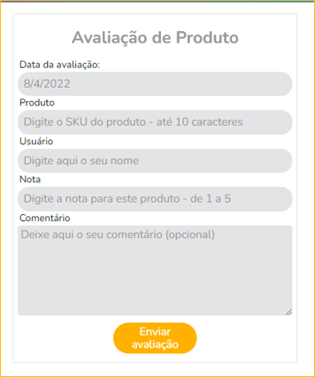

📢 Use this project, [contribute](https://github.com/{OrganizationName}/{AppName}) to it or open issues to help evolve it using [Store Discussion](https://github.com/vtex-apps/store-discussion).

# rattings-reviews

<!-- DOCS-IGNORE:start -->
<!-- ALL-CONTRIBUTORS-BADGE:START - Do not remove or modify this section -->
[](#contributors-)
<!-- ALL-CONTRIBUTORS-BADGE:END -->
<!-- DOCS-IGNORE:end -->


This app is a form to do product ratings. It has 4 input fields mandatory, and 1 textarea non-mandatory.
the fields are identifier the product rated, the rater customer, the date of rating and the rating note. The textarea is for a comment about the product. There is even a button to send the data to a linked Master Data.




## Configuration of use

1. Adding the app as a theme dependency in the `manifest.json` file:
`"acctglobal.rattings-reviews": "0.x"`
2. Declaring the app's main block in your store-theme template or inside another block from the theme.

```
{
  "store.home": {
    "blocks": ["rattings-reviews"]
  } 
}
```


## Modus Operandi *(not mandatory)*

It is necessary to link this app to a Master Data whose form has the same fields. In this case, the API call is made with fetch in a REST endpoint Documents, like this:
```
 fetch('/api/dataentities/YA/documents', requestOptions)
 ...
 ```
*YA* means *your acronym*. This endpoint to is an entity in Master Data v1, where the entities is named with an acronym of 2 captalize letters. If your data entity is created in Master Data v2, the acronym must be changed for the name of the entity


## Customization

For customization of fields and the button, about colors and shapes was used [Tachyons](https://tachyons.io/). The *font-family* is inherited from the theme

`No CSS Handles are available yet for the app customization.`

<!-- DOCS-IGNORE:start -->

## Contributors ✨

Thanks goes to these wonderful people:

<!-- ALL-CONTRIBUTORS-LIST:START - Do not remove or modify this section -->
<!-- prettier-ignore-start -->
<!-- markdownlint-disable -->
<!-- markdownlint-enable -->
<!-- prettier-ignore-end -->
<!-- ALL-CONTRIBUTORS-LIST:END -->

This project follows the [all-contributors](https://github.com/all-contributors/all-contributors) specification. Contributions of any kind are welcome!

<!-- DOCS-IGNORE:end -->

---- 

Check out some documentation models that are already live: 
- [Breadcrumb](https://github.com/vtex-apps/breadcrumb)
- [Image](https://vtex.io/docs/components/general/vtex.store-components/image)
- [Condition Layout](https://vtex.io/docs/components/all/vtex.condition-layout@1.1.6/)
- [Add To Cart Button](https://vtex.io/docs/components/content-blocks/vtex.add-to-cart-button@0.9.0/)
- [Store Form](https://vtex.io/docs/components/all/vtex.store-form@0.3.4/)
